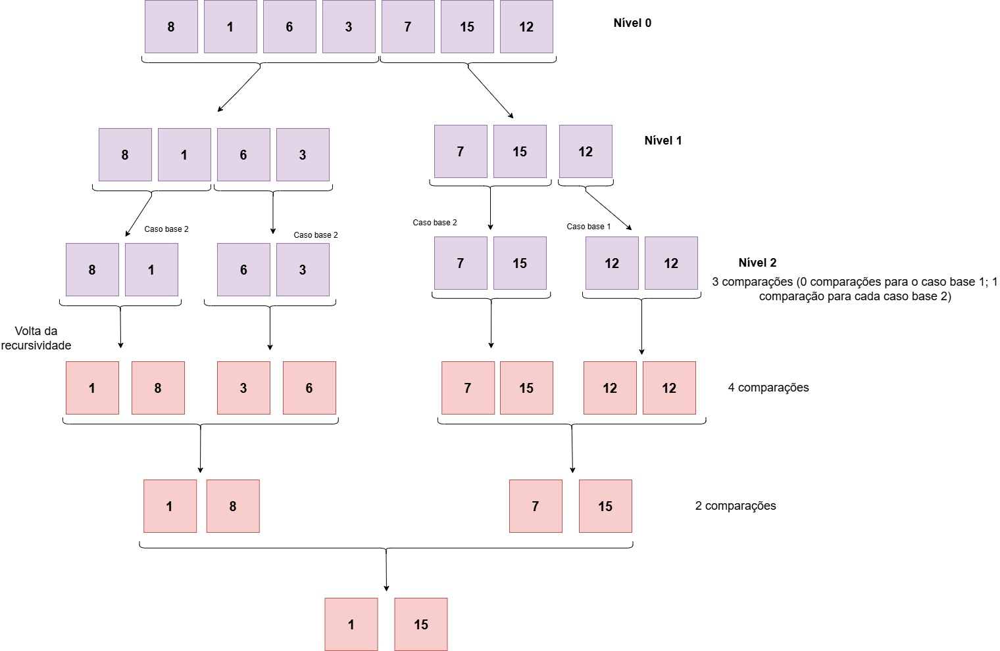

# Algoritmo de Seleção Simultânea do Maior e do Menor Elementos (MaxMin Select)
 ## O que é este projeto?
 Este projeto apresenta uma implementação em python do algoritmo de Seleção Simultânea do Maior e do Menor Elementos, bem como um relatório técnico com uma análise da complexidade assintótica pelo método da contagem de operações e também pela aplicação do Teorema Mestre.  

 ## O que é o algoritmo MaxMin Select?
Este algoritmo é um método para se encontrar o maior e o menor elementos de um conjunto de dados, utilizando a abordagem de dividir e conquistar. <br>

Este algoritmo divide um vetor recursivamente em duas partes menores. Em cada divisão, o algoritmo encontra o menor e o maior elementos de cada metade e, depois, combina os resultados, comparando apenas os dois menores e os dois maiores encontrados. A recursão continua até chegar aos casos base, que são vetores de tamanho 1 ou 2. <br>

A vantagen deste método é que ele diminui o número de comparações em relação a encontrar o mínimo e o máximo separadamente ou utilizando uma abordagem iterativa.

## Como rodar o projeto
Para rodar o projeto, é preciso ter o Python 3 instalado e uma IDE. A partir disso, execute no terminal o seguinte comando:
```bash
   python main.py
```
## Lógica da implementação

```python
def max_min(arr, inicio, fim):
```
A função começa recebendo três argumentos: 
1. arr - representa o array do qual os elementos máximo e mínimo serão extraídos.
2. inicio - representa o índice inicial do array.
3. fim - representa o índice final do array.
---

```python
    if inicio == fim:
        return [arr[inicio], arr[inicio]]
```
Caso base 1: quando o índice inicial é igual ao índice final, significa que o array tem apenas 1 elemento. Nesse caso, ele é retornado como o mínimo e o máximo. 

---
```python
  if fim == inicio + 1:
        if arr[inicio] < arr[fim]:
            return [arr[inicio], arr[fim]]
        else:
            return [arr[fim], arr[inicio]]
```
Caso base 2: quando o índice final é uma unidade maior que o inicial, significa que o array tem 2 elementos. Nesse caso, é realizada uma comparação para descobrir o mínimo e o máximo, e o vetor correspondente é retornado.

---
```python
  meio = (inicio + fim) // 2
```
Nesta etapa, é inicializada a variável meio, que indica o índice central do array que está sendo analisado em um dado momento da recursão.

---
```python
 arr1 = max_min(arr, inicio, meio)
 arr2 = max_min(arr, meio + 1, fim)
```
Aqui, acontecem as chamadas recursivas:
- A chamada atribuída à variável arr1 recebe como parâmetros o array, o índice inicio e o índice meio, pois será responsável por analisar a primeira metade do array e retornar o menor e o maior valor dessa parte.
- Já a chamada atribuída à variável arr2 recebe o array, o índice meio + 1 e o índice fim, ficando encarregada de analisar a segunda metade do array e também retornar o menor e o maior valor correspondente.
--- 
```python
min_val = min(arr1[0], arr2[0])
max_val = max(arr1[1], arr2[1])
```
Com os vetores de cada chamada recursiva retornados, chagou o momento de combinar eles, de forma a encontrar o mínimo e o máximo. Assim, a variável min_val receberá o valor mínimo, resultante de uma comparação entre os menores valores de arr1 e arr2. Já a variável max_val receberá o valor máximo, resultante de uma comparação entre os maiores valores de arr1 e arr2.

---

 ```python
  return [min_val, max_val]
```
Aqui, são retornados os valores mínimo e máximo do vetor correspondente.

---


---
## Relatório técnico

### Análise da complexidade assintótica pelo Método da Contagem de Operações
Considerando que *C(n)* representa o número de comparações feitas para processar um array de tamanho *n*:

- *C(1)* = 0 - considerando *n* = 1;
- *C(2)* = 1 - considerando *n* = 2;
- *C(n)* = 2C(n/2) + 2 - considerando *n* > 2

Portanto, o número de comparações cresce linearmente com o tamanho da entrada, então a complexidade de tempo é O(n).

### Análise da complexidade assintótica pelo Teorema Mestre
Considerando a seguinte recorrência do MaxMin Select: <br>

 𝑇(𝑛) = 2𝑇 (𝑛 / 2) + 𝑂(1) 

 Temos que os valores de *a*, *b* e *f(n)*, são:
- *a* = 2
- *b* = 2
- *f(n)* = O(1)

Calculando o log<sub>b</sub>(a) -> log<sub>2</sub>(2) = 1.

Com isso, calculando o custo da recursão, temos:
O(n<sup>1</sup>) = O(n)

Assim, o custo da recursão é maior que o custo externo: O(n) > O(1). Com isso, o algoritmo se encaixa no Caso 1, onde o custo da recursão domina.

Com isso, a solução assintótica é: <br>

*T(n)* = Θ(n<sup>log<sub>b</sub>a</sup>) <br>
*T(n)* = Θ(n<sup>log<sub>2</sub>2</sup>) <br>
*T(n)* = Θ(n<sup>1</sup>) <br>
*T(n)* = Θ(n)


 


